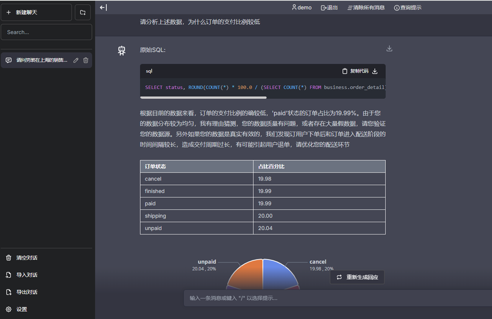
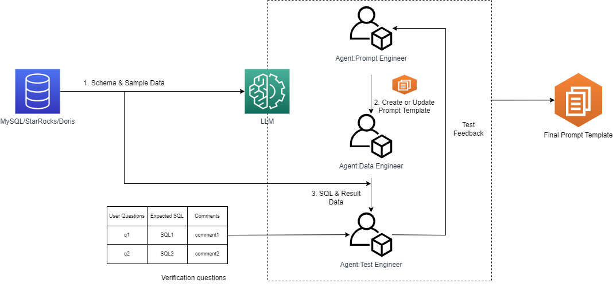
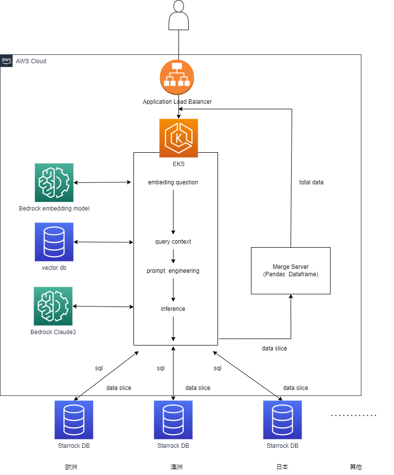

# 多角色智能体协同技术构建会话式BI（Text2SQL)
能够帮助企业快速构建自己的会话式BI工具，帮助一线数据使用者探索分析数据而无需复杂的人工干预。一般情况构建生成式BI，要提高BI响应的准确性，需要对数据提供尽可能详尽的描述，帮助大模型理解数据的业务含义。这个过程一般叫做提示词工程。本方案基于多角色Agent协同技术，简化提示词工程的复杂性，构建高准确度的生成式BI


## 项目初衷
1. 解决业务逻辑及业务术语繁杂，提示词工程复杂度高带来的问题。
2. 解决提示词的微调稍有不慎造成影响扩散。
3. 解决涉及多表的复杂查询无法生成准确的SQL。

## 主要功能
1. 使用自然语言查询数据，并生成图表
2. 自动生成提示词，并使用多角色Agent协同技术对提示词进行优化，提高查询准确性
3. 支持自定义SQL模板，解决复杂SQL的生成问题
4. 支持按角色的数据权限管理，帮助你对数据进行行列粒度的管控
5. 支持联邦查询功能，可以从多个数据源联合查询，服务端进行合并
6. 支持代理部署模式，数据查询服务和模型推理服务分离部署

## 应用场景
非数据专业一线业务人员，可以利用本方案以会话的形式和数据交互，以表格和图表展示数据，并对数据进行充分的解释，帮助你理解数据，进行数据探索和分析，并提供运营建议


## 架构

项目使用多角色Agent 协同构建提示词模板，提高查询准确性。提示词模板是对被查询数据的描述，用于让大模型理解数据的含义，从而回应用户的查询

1. Prompt Engineer Agent 从源库获取涉及的表的元信息和采样数据，经过分析后生成提示词模板
2. Data Engineer Agent 使用上个步骤产生的提示词模板，和测试问题集合，生成SQL,并执行获取返回的结果
3. Test Engineer Agent 根据用户提供的测试问题集的信息，和上个步骤返回的数据，评判生成SQL的质量，生成反馈
4. Prompt Engineer Agent 根据反馈重新生成提示词模板，进入下一轮迭代优化
5. 最终生成的最优提示词模板被做为实际推理的提示词上下文


项目整体架构如下

1. 用户发起请求后，用户问题进行embedding 
2. 系统根据用户问题查找向量库寻找合适的提示词模板
3. 系统根据提示词模板构建问题上下文
4. 系统提交问题到大语言模型，获得推理结果，生成SQL和问题建议
5. 系统使用SQL 向底层数据库查询数据，并对返回的数据进行加工，合并，处理
6. 将数据和建议返回客户端


## 部署
### 前提条件
1. 安装依赖
```
pip install -r requirement.txt
```
2. 项目使用了 Amazon Cognito 用户池进行身份认证登录，请创建Cognito 用户池，并添加访问用户

3. 配置
进入.env文件，根据注释提供aws ak, sk，部署宿主机器，数据库信息

### 生成和优化提示词
1. 请使用如下命令查看相关命令用法
```
python prompt_gen.py
```
2. 使用如下命令生成提示词模板
```
python prompt_gen.py template --scenario {场景名称} --tables {表名1} {表名2} {表名3}
```
上述命令会对传入的表进行提示词自动生成，最终会生成一个 场景名称.xlsx 的提示词模板文件，位于
```
/prompt/data/promptdata/{场景名称.xlsx}
```
如果这个场景是使用者默认查询最多查询场景，给文件名添加_default后缀

例如：
```
python prompt_gen.py template --scenario ecommerce --tables order_detail users goods
```
生成的提示词模板位于
```
/prompt/data/promptdata/ecommerce.xlsx
```
如果这个场景是使用者默认查询最多查询场景，则修改ecommerce.xlsx 为 ecommerce_default.xlsx

3. 你也可以打开该提示词模板文件，根据你对业务的了解进一步的审核和修改. 
这里有一个使用demo数据生成的提示词模板，你可以下载下来参考
```
/assets/orders_default.xlsx
```

4. 如果你对提示词模板文件进行了内容上的调整和修改，请重新放会/prompt/data/promptdata/ 目录

5. 使用如下命令生成最终的提示词
```
python prompt_gen.py template
```
上述命令会生成最终的版本的提示词并且上传到配置文件中指定的s3 目录

### 运行ChatBI
1. 你可以使用提供的Dockerfile分别构建前后端部署在虚拟机或者k8s中，详细步骤不再赘述。这里以部署在虚拟机中举例
```
# build 前端
docker build -t text2sql_dev .

# 启动前端
docker run --env-file=.env -p 5017:8900  --name textdemo2 text2sql_dev

# build后端
docker build -f DockerfileServer -t text2sql_server .

# 启动后端
docker run -p 5018:80 -v ~/work/chat-bi/logs:/app/logs  --name textdemoserver text2sql_server
```
使用浏览器打开ip:5017

## 补充信息

### 配置本地文件下载
默认情况下，数据文件会上传到s3,使用s3 文件预签名提供数据文件下载，如果你的目标用户环境无法访问公网希望使用服务器做为下载服务，避免使用公网访问，你可以如下
创建一个downloads文件夹
```
mkdir downloads
cd downloads
```

创建一个简单的文件服务器,例如
```
python3 -m http.server 端口号

python3 -m http.server 5023
```

进入环境变量文件.env，添加环境变量
```
DOWNLOAD_HOST={文件服务器的公网或内网IP}:端口
```

### 配置模型代理服务器
如何你的网络环境访问大模型不稳定，则需要使用代理
1. 修改.env配置文件，修改LLM_PROXY_SERVER参数，该参数是你可以访问大模型地区虚拟的IP及分配给代理服务的端口
2. 运行如下命令启动代理服务
```
python3 mainproxy.py
```
3.使用更新后的.env配置文件，重新启动chatbi的后的服务
```
python3 main.py
```

