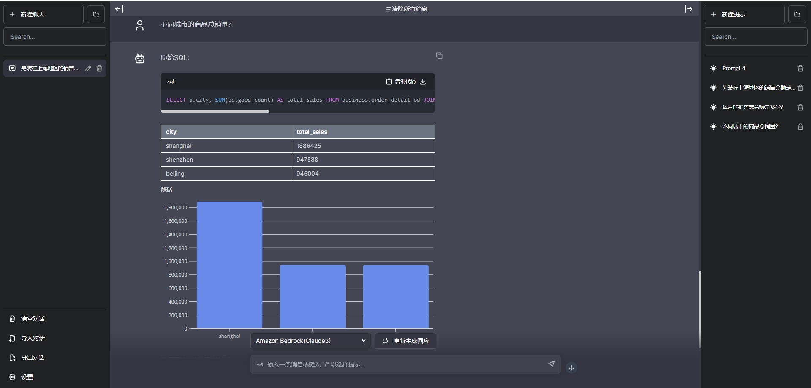

# 使用Bedrock 构建生成式BI
*代码原型使用aws rp团队*

## 快速体验
1. 配置环境变量
进入.env文件，根据注释提供aws ak, sk等信息


# 如果在中国区，请手动执行
```
git clone -b v1.7.4 --depth 1 https://github.com/facebookresearch/faiss.git deps/faiss
```
2. 启动docker
```
docker build -t text2sql_dev .

docker run --env-file=.env -p 5010:8900  --name textdemo1 text2sql
docker run --env-file=.env -p 5017:8900  --name textdemo2 text2sql_dev


docker build -f DockerfileServer -t text2sql_server .

docker run -p 5018:80 -v ~/work/chat-bi/logs:/app/logs  --name textdemoserver text2sql_server

docker run -p 5018:80  --name textdemoserver text2sql_server

```

使用浏览器打开
ip:5017


## 配置本地文件下载
默认情况下，数据文件会上传到s3,提供下载，如果你希望使用服务器做为下载服务，避免使用公网访问s3客户如下配置
创建一个downloads文件夹
```
mkdir downloads
cd downloads
```

创建一个简单的文件服务器,例如
```
python3 -m http.server 端口号

python3 -m http.server 5023
```

进入环境变量文件.env，添加环境变量
```
DOWNLOAD_HOST={文件服务器的公网或内网IP}:端口
```


## 如何配置数据
1. 进入prompt文件夹
2. 参考README.md文件配置数据
3. 重新运行docker 


